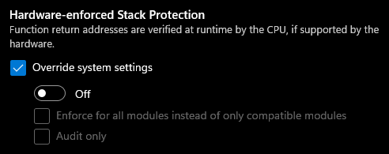
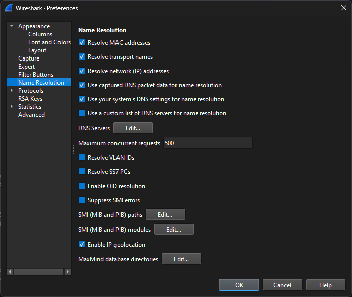
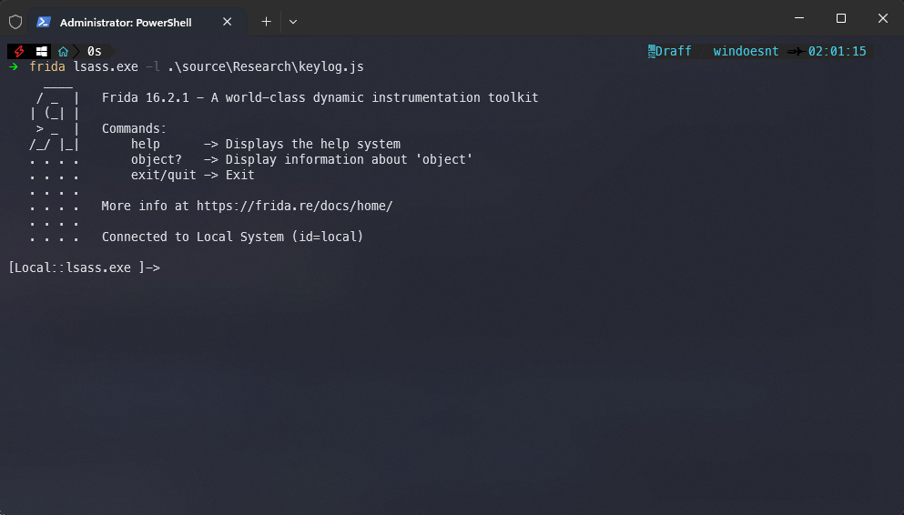
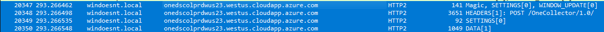
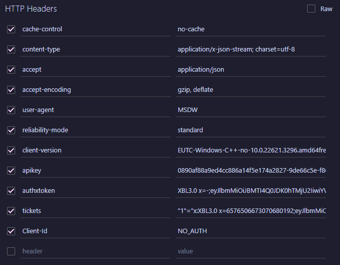
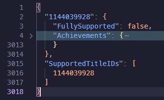
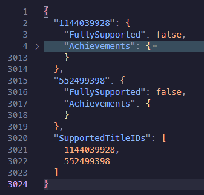

# Events Guide

This guide provides information on how to work with events, set up your system to see events, and how to use events in the tool.

## Table of Contents

- [Events Guide](#events-guide)
  - [Table of Contents](#table-of-contents)
  - [Information](#information)
    - [Events Overview](#events-overview)
      - [Anonymising Events](#anonymising-events)
        - [Raw Event](#raw-event)
        - [Anonymised Event](#anonymised-event)
    - [Setup Guide](#setup-guide)
      - [Prerequisites](#prerequisites)
        - [Frida](#frida)
        - [Wireshark](#wireshark)
        - [Windows Settings](#windows-settings)
      - [Viewing Events](#viewing-events)
      - [Sending Events](#sending-events)
        - [Headers](#headers)
        - [Body](#body)
        - [Errors](#errors)
  - [Using Events In The Tool](#using-events-in-the-tool)
    - [Support Overview](#support-overview)
      - [Obtaining Your Events Token](#obtaining-your-events-token)
    - [Adding Your Own Game](#adding-your-own-game)
      - [Good Luck Achievements](#good-luck-achievements)
      - [Bad Luck Achievements](#bad-luck-achievements)
      - [Preparing a Template](#preparing-a-template)
      - [Preparing the Criteria](#preparing-the-criteria)
        - [Standard Replace](#standard-replace)
        - [Range Replace (Int)](#range-replace-int)
        - [Range Replace (Float)](#range-replace-float)
        - [Special Replacements](#special-replacements)
        - [Ordering Criteria](#ordering-criteria)
      - [Examples](#examples)
        - [Good Luck Achievement](#good-luck-achievement)
          - [Step 1. Monitor an event of an achievement unlocking and anonymise that event data](#step-1-monitor-an-event-of-an-achievement-unlocking-and-anonymise-that-event-data)
          - [Step 2. Figure out the important values within the data section](#step-2-figure-out-the-important-values-within-the-data-section)
          - [Step 3. Create the template](#step-3-create-the-template)
          - [Step 4. Create the data](#step-4-create-the-data)
          - [Step 5. Add the achievement criteria](#step-5-add-the-achievement-criteria)
        - [Bad Luck Achievement](#bad-luck-achievement)
          - [Step 1. Monitor an event of an achievement unlocking and anonymise that event data](#step-1-monitor-an-event-of-an-achievement-unlocking-and-anonymise-that-event-data-1)
          - [Step 2. Figure out the important values within the data section](#step-2-figure-out-the-important-values-within-the-data-section-1)
          - [Step 3. Create the template](#step-3-create-the-template-1)
          - [Step 4. Create the data](#step-4-create-the-data-1)
          - [Step 5. Add the achievement criteria](#step-5-add-the-achievement-criteria-1)
    - [Stats Editor](#stats-editor)

## Information
> [!WARNING]  
> This document is techincal and is not intended to be user friendly. This is not intended for normal users.
### Events Overview

Each game has its own set of events that can modify stats. An event from Forza Horizon 3, activated when you purchase a car, as an example. The event is called `Microsoft.XboxLive.T1289871275.CarAddedToGarage`. The `T1289871275` part is the letter T followed by the game's TitleID. Most data outside of the Data section is not required to be valid, as you can see from the Anonymising Events section. Events require additional authentication, which is explained in the "Sending Events" section.

#### Anonymising Events
Events contain lots of identifying information you should remove before sharing them on the github repo. I will provide an example of an event straight from wireshark and one prepared to be put into the [events database github repository](https://github.com/Fumo-Unlockers/Events-Database)
##### Raw Event
```json
{
  "ver": "4.0",
  "name": "Microsoft.XboxLive.T1289871275.CarAddedToGarage",
  "time": "2024-04-07T01:11:53.6748551Z",
  "iKey": "o:0890af88a9ed4cc886a14f5e174a2827",
  "ext": {
    "utc": {
      "shellId": 281572416699236352,
      "eventFlags": 514,
      "pgName": "XBOX",
      "flags": 880804513,
      "epoch": "903317",
      "seq": 807
    },
    "privacy": {
      "isRequired": false
    },
    "metadata": {
      "f": {
        "baseData": {
          "f": {
            "properties": {
              "f": {
                "BuildNum": 4,
                "CarId": 4,
                "IsHorizonEdition": 4,
                "NumCarsInGarage": 4,
                "Track": 4
              }
            }
          }
        }
      },
      "policies": 0
    },
    "os": {
      "bootId": 284,
      "name": "Windows",
      "ver": "10.0.22621.3296.amd64fre.ni_release.220506-1250",
      "expId": "RS:1B54D,MD:283BAEF,ME:28279A6,MD:2A69053,MD:255521A"
    },
    "app": {
      "id": "U:Microsoft.OpusPG_1.0.125.2_x64__8wekyb3d8bbwe!OpusReleaseFinal",
      "ver": "1.0.125.2_x64_!2018/06/05:22:52:33!60EF05C!forza_x64_release_final.exe",
      "is1P": 1,
      "asId": 898
    },
    "device": {
      "localId": "s:0039DA16-8F86-463F-9EBE-CB0619831735",
      "deviceClass": "Windows.Desktop"
    },
    "protocol": {
      "devMake": "Micro-Star International Co., Ltd.",
      "devModel": "MS-7E06",
      "ticketKeys": [
        "21171495"
      ]
    },
    "user": {
      "localId": "w:EFEB6F6A-3B57-C3DA-5A6B-B5908C25B28C"
    },
    "loc": {
      "tz": "+01:00"
    }
  },
  "data": {
    "baseType": "Microsoft.XboxLive.InGame",
    "baseData": {
      "name": "CarAddedToGarage",
      "serviceConfigId": "19020100-9575-4c2b-9916-3d664ce1dfab",
      "playerSessionId": "DBF9D623-02F2-4CAB-866E-EDF6908C9491",
      "titleId": "1289871275",
      "userId": "1234567890123456",
      "ver": 1,
      "properties": {
        "BuildNum": 156858,
        "CarId": 302,
        "IsHorizonEdition": 0,
        "NumCarsInGarage": 20,
        "Track": 552
      }
    }
  }
}
```

##### Anonymised Event
```json
{
  "ver": "4.0",
  "name": "Microsoft.XboxLive.T1289871275.CarAddedToGarage",
  "time": "REPLACETIME",
  "iKey": "o:0890af88a9ed4cc886a14f5e174a2827",
  "ext": {
    "utc": {
      "shellId": 1,
      "eventFlags": 1,
      "pgName": "XBOX",
      "flags": 1,
      "epoch": "1",
      "seq": REPLACESEQ
    },
    "privacy": {
      "isRequired": false
    },
    "metadata": {
      "f": {
        "baseData": {
          "f": {
            "properties": {
              "f": {
                "BuildNum": 1,
                "CarId": 1,
                "IsHorizonEdition": 1,
                "NumCarsInGarage": 1,
                "Track": 1
              }
            }
          }
        }
      },
      "policies": 0
    },
    "os": {
      "bootId": 1,
      "name": "1",
      "ver": "1",
      "expId": "1"
    },
    "app": {
      "id": "U:Microsoft.OpusPG_1.0.125.2_x64__8wekyb3d8bbwe!OpusReleaseFinal",
      "ver": "1.0.125.2_x64_!2018/06/05:22:52:33!60EF05C!forza_x64_release_final.exe",
      "is1P": 1,
      "asId": 1
    },
    "device": {
      "localId": "s:11111111-1111-1111-1111-111111111111",
      "deviceClass": "Windows.Desktop"
    },
    "protocol": {
      "devMake": "1",
      "devModel": "1",
      "ticketKeys": [
        "1"
      ]
    },
    "user": {
      "localId": "w:11111111-1111-1111-1111-111111111111"
    },
    "loc": {
      "tz": "+01:00"
    }
  },
  "data": {
    "baseType": "Microsoft.XboxLive.InGame",
    "baseData": {
      "name": "CarAddedToGarage",
      "serviceConfigId": "19020100-9575-4c2b-9916-3d664ce1dfab",
      "playerSessionId": "11111111-1111-1111-1111-111111111111",
      "titleId": "1289871275",
      "userId": "REPLACEXUID",
      "ver": 1,
      "properties": {
        "BuildNum": 156858,
        "CarId": 302,
        "IsHorizonEdition": 0,
        "NumCarsInGarage": 20,
        "Track": 552
      }
    }
  }
}
```

### Setup Guide

This section guides you through the process of setting up your system to view events.

#### Prerequisites

To monitor events and use the event-based unlocker in the tool, you need to install Wireshark and Frida and configure them.

##### Frida
The easiest way to install frida is using python pip. You can install frida by running the command
```
pip install frida-tools
```
You can view all install methods on the github repository: https://github.com/frida/frida
> [!WARNING]  
> You must do the following steps if you are using Windows 11
> 1. Open Windows Security
> 2. App & Browser Control>Exploit Protection>Programme Settings
> 3. Press the plus, Select program by name and enter `lsass.exe`
> 4. Scroll down until you see `Hardware Enforced Stack Protection`
> 5. Copy these settings: 
> 
> 

You also need a script to extract data from lsass.
Download the following [script](https://raw.githubusercontent.com/ngo/win-frida-scripts/master/lsasslkeylog-easy/keylog.js) and save it somewhere you will remember for the Viewing Events section

##### Wireshark
1. Install wireshark using the installer on the [website](https://www.wireshark.org/download.html)
2. Make an empty file on the root of your C: drive `C:\keylog.log`
3. Open wireshark and go to Edit>Preferences
4. Click on Name Resolution and make sure your settings are set like this:
   
   
5. Go to Protocols>TLS and then select `C:keylog.log` as (Pre)-Master-Secret log filename
   
##### Windows Settings
1. Press Win+R and type in `services.msc`
2. Open this and scroll until you see `Connected User Experiences and Telemetry`
3. Double click this and change the `Startup Type` to `Automatic`
4. Restart (maybe?)

#### Viewing Events

This section explains how to use Wireshark and Frida to view events from an event-based game.

1. Open an administrator terminal
2. Run frida using the following command `frida lsass.exe -l \Path\To\keylog.js `
3. You should get output like this:

    
4. Open wireshark and select your network interface
5. Put the following string into your filter box `tls && http2 && ip.dst_host contains "cloudapp.azure.com"`
6. Open your game of choice and start doing things
7. Look back at wireshark and you will (hopefully) see requests to a few cloudapp.azure.com domains
   
   
8. Now click on "DATA" and then navigate to `Uncompressed entity body`
9. You can now read events (yay)

#### Sending Events

This section will be relatively bare as I assume anyone who wants to test and play around with events like this is smart enough to figure stuff out with minimal handholding. I will be using the visual studio code extension `Thunder Client` but any HTTP client will do
To start off you will need an event to work with. Get one from the Viewing Events section
##### Headers
Now not all headers are required. You only need the following headers:



All headers other than `tickets` and `authxtoken` are static.
##### Body
The json body ***cannot*** be formatted. The endpoint will throw back a parsing error if it is. Use a json minifier before sending the data away if you want to edit it while it is formatted nicely.
You must also increment the `seq` value every time after sending an event. This increment does not need to be by 1 so if you lose your place you can just add 100 or 1000 to the value
##### Errors
The endpoint is nice about formatting errors and it tells you when they exist but other than that it is pretty quiet about errors. If any of your auth tokens are expired it will silently fail while giving a 200 response and the same acc 1 json it would on a success.
The same goes for not incrementing seq

## Using Events In The Tool

### Support Overview

The tool supports manually defined achievement criteria and has a stats editor in progress.

#### Obtaining Your Events Token

To use the event-based functionality in the tool, you need to input your own events token.
1. Follow the guide for Viewing Events
2. Instead of clicking on `DATA` click on `HEADERS`
3. You want to scroll until you see a tickets header that starts with something like `"2145125"="x:XBL3.0 x="` (The number will be different)
4. Copy from the start of `x:XBL3.0 x=` and stop before the last `"`. You should completely skip the number and anything before the first x
5. Your copied token should look something like this `x:XBL3.0 x=somenumbers;a very large amount of letters`
6. You now have a usable Events Token to input into the tool

### Adding Your Own Game

This section explains how to add support for a game, find the correct events and stats, and prepare a template and criteria.

#### Good Luck Achievements

These achievements work similarly to title-based games and only require an ID input into a generic "achievement unlocked" event.
As an example here is the data section of a Gears of War 4 event called `Microsoft.XboxLive.T552499398.UnlockAchievement`
```json
"data": {
    "baseType": "Microsoft.XboxLive.InGame",
    "baseData": {
      "name": "UnlockAchievement",
      "serviceConfigId": "780f0100-3c66-41ff-b8cc-964f20ee78c6",
      "playerSessionId": "11111111-1111-1111-1111-111111111111",
      "titleId": "552499398",
      "userId": "1234567890123456",
      "ver": 1,
      "properties": {
        "AchievementID": 1,
        "MatchId": "Front End",
        "MatchJoinId": 0
      },
      "measurements": {
        "ProgressPercent": 1
      }
    }
  }
```
These achievements are very easy to unlock and don't require much work to support as you can just try every AchivementID and then take note of which achievements unlock to then write the criteria.

#### Bad Luck Achievements

These achievements require specific stats to be unlocked. These achievements are much harder to work with and take more work to support (usually due to multiple requirements per achievement). As an example I will use the data section of a Halo MCC event called `Microsoft.XboxLive.T1144039928.MissionCompleted` This is a generic Mission Complete event which means it will handle most if not all mission completion achievements for this game.
```json
"data": {
    "baseType": "Microsoft.XboxLive.InGame",
    "baseData": {
      "name": "MissionCompleted",
      "serviceConfigId": "77290100-225e-4768-9373-98164430a9f8",
      "titleId": "1144039928",
      "userId": "1234567890123456",
      "properties": {
        "Coop": 0,
        "DatePlayedUTC": 133577376536650000,
        "DifficultyId": 1,
        "GameCategoryId": 18,
        "HaloTitleId": "HaloReach",
        "Kills": 358,
        "MapId": 179,
        "MissionScore64": 235767,
        "NumPlayers": 1,
        "Penalties": 0,
        "PlayerSectionStats": "{\\\"scores\\\":[0.0,0.0,1553.0,2669.0,3398.0],\\\"interpolatedScores\\\":[0.0,0.0,4659.0,7995.43408203125,7169.02197265625],\\\"times\\\":[0,1,2,3,4],\\\"sectionIDs\\\":[652215696,534971578,329253778,976357054,976684729],\\\"deaths\\\":0,\\\"numPlayers\\\":1,\\\"skullMask\\\":0,\\\"skullCount\\\":0}",
        "SkullUsedFlags": 0,
        "TimePlayedMS": 92356,
        "TotalCoopMissionsComplete": 0,
        "TotalSoloMissionsComplete": 2
      },
      "measurements": {
        "Multiplier": 2.35,
        "SkullMultiplier": 1
      }
    }
  }
```
As you can see there is a significant amount of data in this data section. For example, to meet criteria for a mission complete the only thing needed is the correct `MapId` however if you wanted to unlock the achievement for par score you would also need a `MissionScore64` value above the par score criteria, the same goes for par time and `TimePlayedMS` although you would want it under the criteria in that case. Guessing from other data available this event could also be used to get the achievements for LASO runs and possibly even some kill related achievements.

#### Preparing a Template

Each game needs a template, I will be using Halo MCC as an example for this section. I will show criteria for both a Good Luck and a Bad Luck achievement.
You first need to anonymise the event using the [Anonymising Events](#anonymising-events) section
Now you need to figure out which criteria you need to create and where you would need to place these criteria

#### Preparing the Criteria
The criteria replace certain strings within the template.

##### Standard Replace
This is the most common type of replacement for criteria and the most simple.
Example from Achievement 900 from halo MCC
```json
"Replacement1": {
          "ReplacementType": "Replace",
          "Target": "REPLACEMAPID",
          "Replacement": 179
        },
```
This replaces the string `REPLACEMAPID` with the number `179`

##### Range Replace (Int)
This type of replacement will be required when data is on leaderboards like halo MCC where I would not like all users to have exactly the same statistics as well as for other achievements relating to clearing something within a certain time.
Example from Achievement 900 from halo MCC:
```json
"Replacement3": {
          "ReplacementType": "RangeInt",
          "Target": "REPLACEMISSIONSCORE",
          "Min": 12750,
          "Max": 14999
        },
```
This replaces the string `REPLACEMISSIONSCORE` with a number between `12750` and `14999`


##### Range Replace (Float)
This type of replacement is the same as the above but for Float numbers instead of Integers

Example from Achievement 900 from halo MCC:
```json
"Replacement5": {
          "ReplacementType": "RangeFloat",
          "Target": "REPLACEMULTIPLIER",
          "Min": 1,
          "Max": 2
        },
```
This replaces the string `REPLACEMULTIPLIER` with a float between `1` and `2`
##### Special Replacements
These replacements are either required by the tool or are created as exceptions to fill out data otherwise impossible.

They currently consist of:
- REPLACEXUID (Required)
- REPLACETIME (Required)
- REPLACESEQ (Required)
- LDAP timestamp (Exception: Created for Halo MCC mission completion timestamp)

##### Ordering Criteria
The order of the criteria within the data.json file is important as the tool starts from the top and works its way down. This allows you to replace parts of data you have previously placed.
#### Examples
##### Good Luck Achievement
In this example, I will be using Gears Of War 4

###### Step 1. Monitor an event of an achievement unlocking and anonymise that event data

```json
{
    "ver": "4.0",
    "name": "Microsoft.XboxLive.T552499398.UnlockAchievement",
    "time": "REPLACETIME",
    "iKey": "o:0890af88a9ed4cc886a14f5e174a2827",
    "ext": {
        "utc": {
            "shellId": 1,
            "eventFlags": 1,
            "pgName": "XBOX",
            "flags": 1,
            "epoch": "1",
            "seq": REPLACESEQ
        },
        "privacy": {
            "isRequired": false
        },
        "metadata": {
            "f": {
                "baseData": {
                    "f": {
                        "properties": {
                            "f": {
                                "AchievementID": 1,
                                "MatchJoinId": 1
                            }
                        },
                        "measurements": {
                            "f": {
                                "ProgressPercent": 1
                            }
                        }
                    }
                }
            },
            "policies": 0
        },
        "os": {
            "bootId": 1,
            "name": "1",
            "ver": "1",
            "expId": "1"
        },
        "app": {
            "id": "U:Microsoft.SpartaUWP_14.4.0.2_x64__8wekyb3d8bbwe!GearGameShippingPublic",
            "ver": "14.4.0.2_x64_!2019/06/27:23:38:26!9474C5E!geargame.exe",
            "is1P": 1,
            "asId": 1
        },
        "device": {
            "localId": "s:11111111-1111-1111-1111-111111111111",
            "deviceClass": "Windows.Desktop"
        },
        "protocol": {
            "devMake": "1",
            "devModel": "1",
            "ticketKeys": [
                "1"
            ]
        },
        "user": {
            "localId": "s:11111111-1111-1111-1111-111111111111"
        },
        "loc": {
            "tz": "00:00"
        }
    },
    "data": {
        "baseType": "Microsoft.XboxLive.InGame",
        "baseData": {
            "name": "UnlockAchievement",
            "serviceConfigId": "780f0100-3c66-41ff-b8cc-964f20ee78c6",
            "playerSessionId": "11111111-1111-1111-1111-111111111111",
            "titleId": "552499398",
            "userId": "REPLACEXUID",
            "ver": 1,
            "properties": {
                "AchievementID": 4,
                "MatchId": "11111111-1111-1111-1111-111111111111",
                "MatchJoinId": 0
            },
            "measurements": {
                "ProgressPercent": 1
            }
        }
    }
}
```
###### Step 2. Figure out the important values within the data section

In this case, it would be the AchievementID which is 4. We can check our recently unlocked achievements to see that this ID matches up with the Triple Play achievement which is ID 70 on the API
###### Step 3. Create the template
Knowing that AchievementId is our only important value we can set up the template like this:
```json
{
    "ver": "4.0",
    "name": "Microsoft.XboxLive.T552499398.UnlockAchievement",
    "time": "REPLACETIME",
    "iKey": "o:0890af88a9ed4cc886a14f5e174a2827",
    "ext": {
        "utc": {
            "shellId": 1,
            "eventFlags": 1,
            "pgName": "XBOX",
            "flags": 1,
            "epoch": "1",
            "seq": REPLACESEQ
        },
        "privacy": {
            "isRequired": false
        },
        "metadata": {
            "f": {
                "baseData": {
                    "f": {
                        "properties": {
                            "f": {
                                "AchievementID": 1,
                                "MatchJoinId": 1
                            }
                        },
                        "measurements": {
                            "f": {
                                "ProgressPercent": 1
                            }
                        }
                    }
                }
            },
            "policies": 0
        },
        "os": {
            "bootId": 1,
            "name": "1",
            "ver": "1",
            "expId": "1"
        },
        "app": {
            "id": "U:Microsoft.SpartaUWP_14.4.0.2_x64__8wekyb3d8bbwe!GearGameShippingPublic",
            "ver": "14.4.0.2_x64_!2019/06/27:23:38:26!9474C5E!geargame.exe",
            "is1P": 1,
            "asId": 1
        },
        "device": {
            "localId": "s:11111111-1111-1111-1111-111111111111",
            "deviceClass": "Windows.Desktop"
        },
        "protocol": {
            "devMake": "1",
            "devModel": "1",
            "ticketKeys": [
                "1"
            ]
        },
        "user": {
            "localId": "s:11111111-1111-1111-1111-111111111111"
        },
        "loc": {
            "tz": "00:00"
        }
    },
    "data": {
        "baseType": "Microsoft.XboxLive.InGame",
        "baseData": {
            "name": "UnlockAchievement",
            "serviceConfigId": "780f0100-3c66-41ff-b8cc-964f20ee78c6",
            "playerSessionId": "11111111-1111-1111-1111-111111111111",
            "titleId": "552499398",
            "userId": "REPLACEXUID",
            "ver": 1,
            "properties": {
                "AchievementID": REPLACECRITERA1,
                "MatchId": "11111111-1111-1111-1111-111111111111",
                "MatchJoinId": 0
            },
            "measurements": {
                "ProgressPercent": 1
            }
        }
    }
}
```
`REPLACECRITERIA1` is the only thing we need to change to unlock these Good Luck achievements.
This file will be saved as the TitleID `552499398.json`
###### Step 4. Create the data
Open `Data.json` and check to see if `552499398` is already in the `SupportedTitleIDs` list. It is not, meaning we need to add a new game entry to this file. The only supported game is currently Halo MCC


First, add the title ID to `SupportedTitleIDs`
```json
"SupportedTitleIDs": [
    1144039928,
    552499398
  ]
```
Secondly, create a new section within the json file
```json
"552499398": {
    "FullySupported": false,
    "Achievements": {
    }
  }
```
The json file should now look like this:


###### Step 5. Add the achievement criteria
We know that 4 matches up with achievement id 70 so we will add this
```json
"552499398": {
    "FullySupported": false,
    "Achievements": {
      "70": {
        "CriteriaReplacement": {
          "ReplacementType": "Replace",
          "Target": "REPLACECRITERA1",
          "Replacement": "4"
        }
      }
    }
  },
```
##### Bad Luck Achievement
The majority of this guide is the same as Good Luck achievement so I will only go over the changes
###### Step 1. Monitor an event of an achievement unlocking and anonymise that event data
```json
{
    "ver": "4.0",
    "name": "Microsoft.XboxLive.T1144039928.MissionCompleted",
    "time": "REPLACETIME",
    "iKey": "o:0890af88a9ed4cc886a14f5e174a2827",
    "ext": {
        "utc": {
            "shellId": 1,
            "eventFlags": 1,
            "pgName": "XBOX",
            "flags": 1,
            "epoch": "1",
            "seq": REPLACESEQ
        },
        "privacy": {
            "dataType": 1,
            "isRequired": false
        },
        "metadata": {
            "f": {
                "baseData": {
                    "f": {
                        "properties": {
                            "f": {
                                "AchievementId": 1
                            }
                        },
                        "ver": 1
                    }
                }
            },
            "privTags": 1,
            "policies": 0
        },
        "os": {
            "bootId": 1,
            "name": "1",
            "ver": "1",
            "expId": "1"
        },
        "app": {
            "id": "U:Microsoft.Chelan_1.3385.0.0_x64__8wekyb3d8bbwe!HaloMCCShipping",
            "ver": "1.3385.0.0_x64_!2024/01/03:17:50:38!3E58AE2!mccwinstore-win64-shipping.exe",
            "is1P": 1,
            "asId": 1
        },
        "device": {
            "localId": "s:11111111-1111-1111-1111-111111111111",
            "deviceClass": "Windows.Desktop"
        },
        "protocol": {
            "devMake": "1",
            "devModel": "1",
            "ticketKeys": [
                "1"
            ]
        },
        "user": {
            "localId": "m:11111111111111111"
        },
        "loc": {
            "tz": "00:00"
        }
    },
    "data": {
        "baseType": "Microsoft.XboxLive.InGame",
        "baseData": {
            "name": "MissionCompleted",
            "serviceConfigId": "77290100-225e-4768-9373-98164430a9f8",
            "titleId": "1144039928",
            "userId": "REPLACEXUID",
            "properties": {
                "Coop": 0,
                "DatePlayedUTC": 133583987328905914,
                "DifficultyId": 1,
                "GameCategoryId": 18,
                "HaloTitleId": "HaloReach",
                "Kills": 257,
                "MapId": 179,
                "MissionScore64": 13327,
                "NumPlayers": 1,
                "Penalties": 0,
                "PlayerSectionStats": "{\\\"scores\\\":[0.0,1.0,2.0,3.0,4.0],\\\"interpolatedScores\\\":[0.0,1.0,2.0,3.0,4.0],\\\"times\\\":[0,1,2,3,4],\\\"sectionIDs\\\":[1,2,3,4,5],\\\"deaths\\\":0,\\\"numPlayers\\\":1,\\\"skullMask\\\":0,\\\"skullCount\\\":0}",
                "SkullUsedFlags": 0,
                "TimePlayedMS": 1014169,
                "TotalCoopMissionsComplete": 0,
                "TotalSoloMissionsComplete": 1
            },
            "measurements": {
                "Multiplier": 1.3916192,
                "SkullMultiplier": 1
            }
        }
    }
}
```
###### Step 2. Figure out the important values within the data section
There are lots of important values in this section however we are only focusing on Par Time, Par score and normal completion achievements. I know this event is for the level winter contingency which I will assume is `MapId` 179. I can assume I will need a `MissionScore64` of >15000 for the Par score achievement and a `TimePlayedMS` of <900000 for the Par time achievement. `Kills` and `DatePlayedUTC` are also important values but have no bearing on the achievement criteria for the achievements we are currently working on
###### Step 3. Create the template
Step not required as MCC is already supported
###### Step 4. Create the data
Step not required as MCC is already supported
###### Step 5. Add the achievement criteria
I will be adding three achievements here. Due to MCC having both bad luck and good luck achievements I need to replace the event name and data section for every achievement. These three achievements will be: `We're Just Getting Started (900)`, `Winter Urgency(915)` `Ice In Your Veins(925)`
```json
"900": {
        "EventReplacement": {
          "ReplacementType": "Replace",
          "Target": "REPLACEEVENT",
          "Replacement": "Microsoft.XboxLive.T1144039928.MissionCompleted"
        },
        "DataReplacement": {
          "ReplacementType": "Replace",
          "Target": "REPLACEDATA",
          "Replacement": "{\"baseType\":\"Microsoft.XboxLive.InGame\",\"baseData\":{\"name\":\"MissionCompleted\",\"serviceConfigId\":\"77290100-225e-4768-9373-98164430a9f8\",\"titleId\":\"1144039928\",\"userId\":\"REPLACEXUID\",\"properties\":{\"Coop\":0,\"DatePlayedUTC\":REPLACEDATEPLAYED,\"DifficultyId\":1,\"GameCategoryId\":18,\"HaloTitleId\":\"HaloReach\",\"Kills\":REPLACEKILLS,\"MapId\":REPLACEMAPID,\"MissionScore64\":REPLACEMISSIONSCORE,\"NumPlayers\":1,\"Penalties\":0,\"PlayerSectionStats\":\"{\\\\\\\"scores\\\\\\\":[0.0,1.0,2.0,3.0,4.0],\\\\\\\"interpolatedScores\\\\\\\":[0.0,1.0,2.0,3.0,4.0],\\\\\\\"times\\\\\\\":[0,1,2,3,4],\\\\\\\"sectionIDs\\\\\\\":[1,2,3,4,5],\\\\\\\"deaths\\\\\\\":0,\\\\\\\"numPlayers\\\\\\\":1,\\\\\\\"skullMask\\\\\\\":0,\\\\\\\"skullCount\\\\\\\":0}\",\"SkullUsedFlags\":0,\"TimePlayedMS\":REPLACETIMEPLAYED,\"TotalCoopMissionsComplete\":0,\"TotalSoloMissionsComplete\":1},\"measurements\":{\"Multiplier\":REPLACEMULTIPLIER,\"SkullMultiplier\":1}}}"
        },
        "Replacement1": {
          "ReplacementType": "Replace",
          "Target": "REPLACEMAPID",
          "Replacement": 179
        },
        "Replacement2": {
          "ReplacementType": "RangeInt",
          "Target": "REPLACEKILLS",
          "Min": 200,
          "Max": 300
        },
        "Replacement3": {
          "ReplacementType": "RangeInt",
          "Target": "REPLACEMISSIONSCORE",
          "Min": 12750,
          "Max": 14999
        },
        "Replacement4": {
          "ReplacementType": "RangeInt",
          "Target": "REPLACETIMEPLAYED",
          "Min": 900001,
          "Max": 1035000
        },
        "Replacement5": {
          "ReplacementType": "RangeFloat",
          "Target": "REPLACEMULTIPLIER",
          "Min": 1,
          "Max": 2
        },
        "Replacement6": {
          "ReplacementType": "StupidFuckingLDAPTimestamp",
          "Target": "REPLACEDATEPLAYED"
        }
      },
      "915": {
        "EventReplacement": {
          "ReplacementType": "Replace",
          "Target": "REPLACEEVENT",
          "Replacement": "Microsoft.XboxLive.T1144039928.MissionCompleted"
        },
        "DataReplacement": {
          "ReplacementType": "Replace",
          "Target": "REPLACEDATA",
          "Replacement": "{\"baseType\":\"Microsoft.XboxLive.InGame\",\"baseData\":{\"name\":\"MissionCompleted\",\"serviceConfigId\":\"77290100-225e-4768-9373-98164430a9f8\",\"titleId\":\"1144039928\",\"userId\":\"REPLACEXUID\",\"properties\":{\"Coop\":0,\"DatePlayedUTC\":REPLACEDATEPLAYED,\"DifficultyId\":1,\"GameCategoryId\":18,\"HaloTitleId\":\"HaloReach\",\"Kills\":REPLACEKILLS,\"MapId\":REPLACEMAPID,\"MissionScore64\":REPLACEMISSIONSCORE,\"NumPlayers\":1,\"Penalties\":0,\"PlayerSectionStats\":\"{\\\\\\\"scores\\\\\\\":[0.0,1.0,2.0,3.0,4.0],\\\\\\\"interpolatedScores\\\\\\\":[0.0,1.0,2.0,3.0,4.0],\\\\\\\"times\\\\\\\":[0,1,2,3,4],\\\\\\\"sectionIDs\\\\\\\":[1,2,3,4,5],\\\\\\\"deaths\\\\\\\":0,\\\\\\\"numPlayers\\\\\\\":1,\\\\\\\"skullMask\\\\\\\":0,\\\\\\\"skullCount\\\\\\\":0}\",\"SkullUsedFlags\":0,\"TimePlayedMS\":REPLACETIMEPLAYED,\"TotalCoopMissionsComplete\":0,\"TotalSoloMissionsComplete\":1},\"measurements\":{\"Multiplier\":REPLACEMULTIPLIER,\"SkullMultiplier\":1}}}"
        },
        "Replacement1": {
          "ReplacementType": "Replace",
          "Target": "REPLACEMAPID",
          "Replacement": 179
        },
        "Replacement2": {
          "ReplacementType": "RangeInt",
          "Target": "REPLACEKILLS",
          "Min": 200,
          "Max": 300
        },
        "Replacement3": {
          "ReplacementType": "RangeInt",
          "Target": "REPLACEMISSIONSCORE",
          "Min": 12750,
          "Max": 14999
        },
        "Replacement4": {
          "ReplacementType": "RangeInt",
          "Target": "REPLACETIMEPLAYED",
          "Min": 765000,
          "Max": 899999
        },
        "Replacement5": {
          "ReplacementType": "RangeFloat",
          "Target": "REPLACEMULTIPLIER",
          "Min": 1,
          "Max": 2
        },
        "Replacement6": {
          "ReplacementType": "StupidFuckingLDAPTimestamp",
          "Target": "REPLACEDATEPLAYED"
        }
      },
      "925": {
        "EventReplacement": {
          "ReplacementType": "Replace",
          "Target": "REPLACEEVENT",
          "Replacement": "Microsoft.XboxLive.T1144039928.MissionCompleted"
        },
        "DataReplacement": {
          "ReplacementType": "Replace",
          "Target": "REPLACEDATA",
          "Replacement": "{\"baseType\":\"Microsoft.XboxLive.InGame\",\"baseData\":{\"name\":\"MissionCompleted\",\"serviceConfigId\":\"77290100-225e-4768-9373-98164430a9f8\",\"titleId\":\"1144039928\",\"userId\":\"REPLACEXUID\",\"properties\":{\"Coop\":0,\"DatePlayedUTC\":REPLACEDATEPLAYED,\"DifficultyId\":1,\"GameCategoryId\":18,\"HaloTitleId\":\"HaloReach\",\"Kills\":REPLACEKILLS,\"MapId\":REPLACEMAPID,\"MissionScore64\":REPLACEMISSIONSCORE,\"NumPlayers\":1,\"Penalties\":0,\"PlayerSectionStats\":\"{\\\\\\\"scores\\\\\\\":[0.0,1.0,2.0,3.0,4.0],\\\\\\\"interpolatedScores\\\\\\\":[0.0,1.0,2.0,3.0,4.0],\\\\\\\"times\\\\\\\":[0,1,2,3,4],\\\\\\\"sectionIDs\\\\\\\":[1,2,3,4,5],\\\\\\\"deaths\\\\\\\":0,\\\\\\\"numPlayers\\\\\\\":1,\\\\\\\"skullMask\\\\\\\":0,\\\\\\\"skullCount\\\\\\\":0}\",\"SkullUsedFlags\":0,\"TimePlayedMS\":REPLACETIMEPLAYED,\"TotalCoopMissionsComplete\":0,\"TotalSoloMissionsComplete\":1},\"measurements\":{\"Multiplier\":REPLACEMULTIPLIER,\"SkullMultiplier\":1}}}"
        },
        "Replacement1": {
          "ReplacementType": "Replace",
          "Target": "REPLACEMAPID",
          "Replacement": 179
        },
        "Replacement2": {
          "ReplacementType": "RangeInt",
          "Target": "REPLACEKILLS",
          "Min": 200,
          "Max": 300
        },
        "Replacement3": {
          "ReplacementType": "RangeInt",
          "Target": "REPLACEMISSIONSCORE",
          "Min": 15001,
          "Max": 17250
        },
        "Replacement4": {
          "ReplacementType": "RangeInt",
          "Target": "REPLACETIMEPLAYED",
          "Min": 900001,
          "Max": 1035000
        },
        "Replacement5": {
          "ReplacementType": "RangeFloat",
          "Target": "REPLACEMULTIPLIER",
          "Min": 1,
          "Max": 2
        },
        "Replacement6": {
          "ReplacementType": "StupidFuckingLDAPTimestamp",
          "Target": "REPLACEDATEPLAYED"
        }
      }
    }
```


### Stats Editor

This section is under construction.